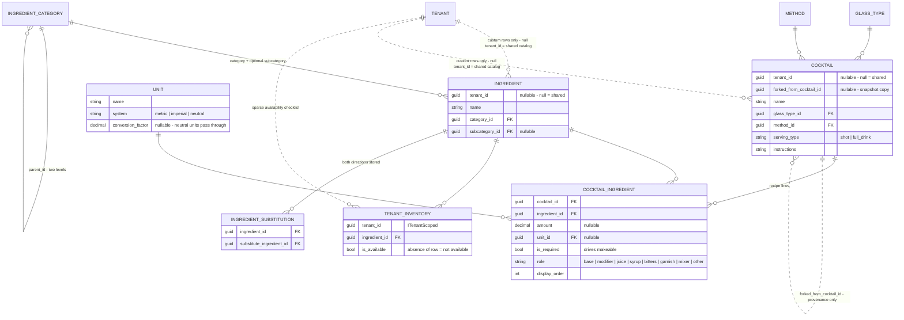
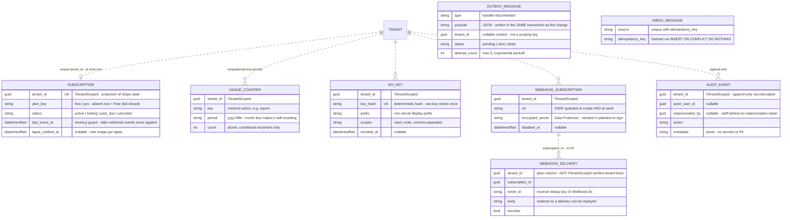
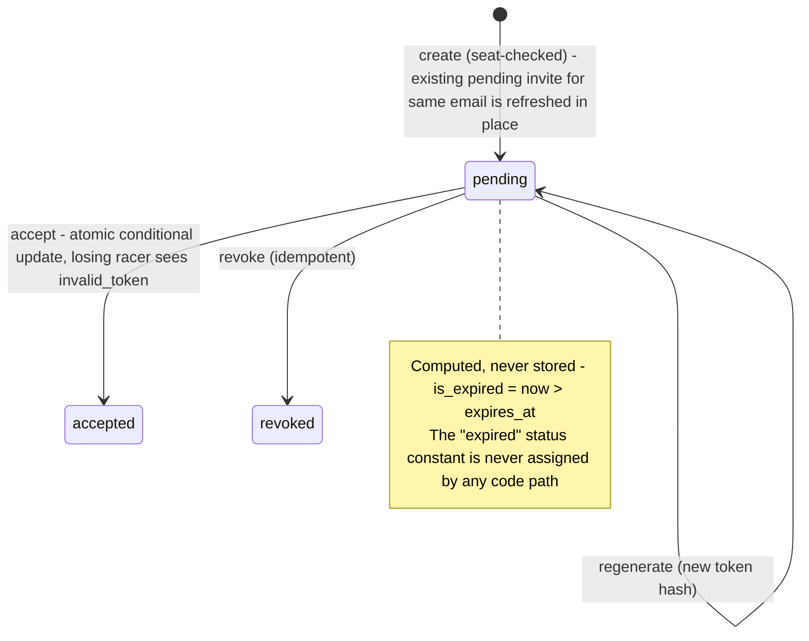
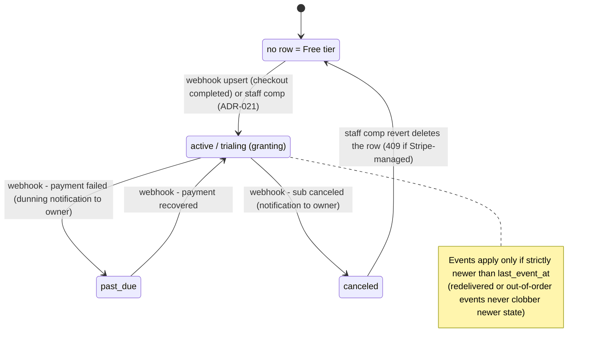
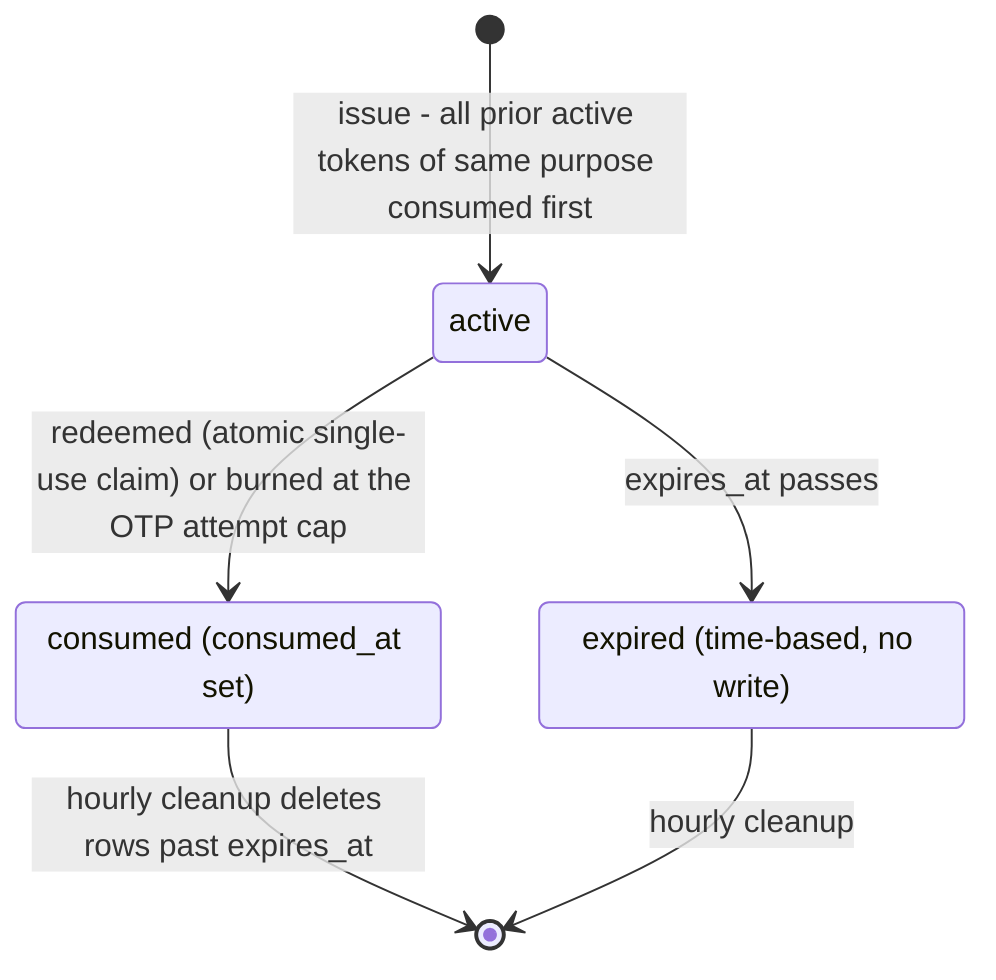
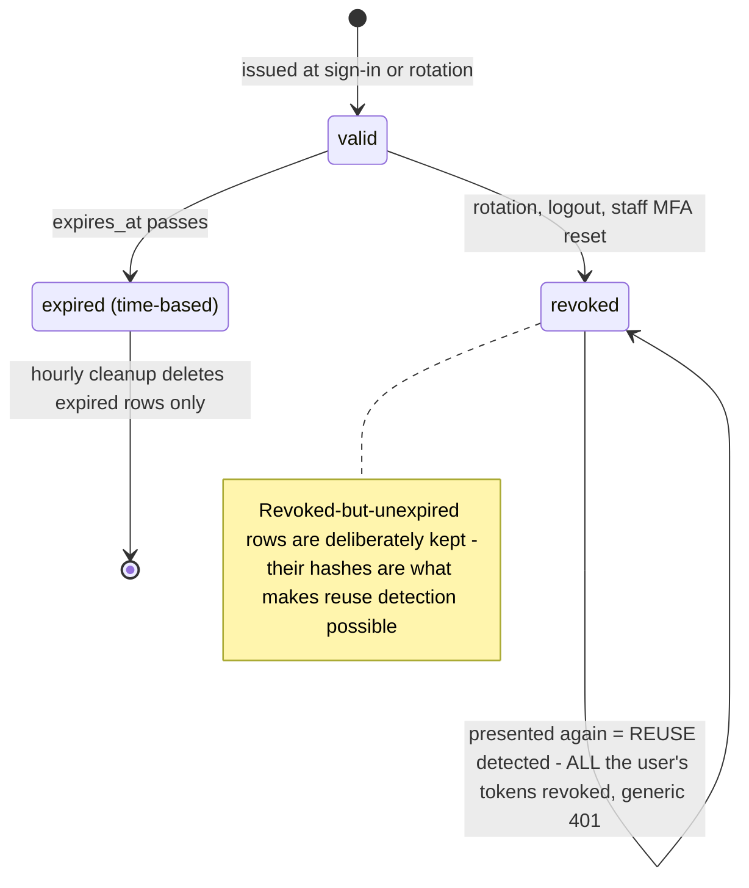
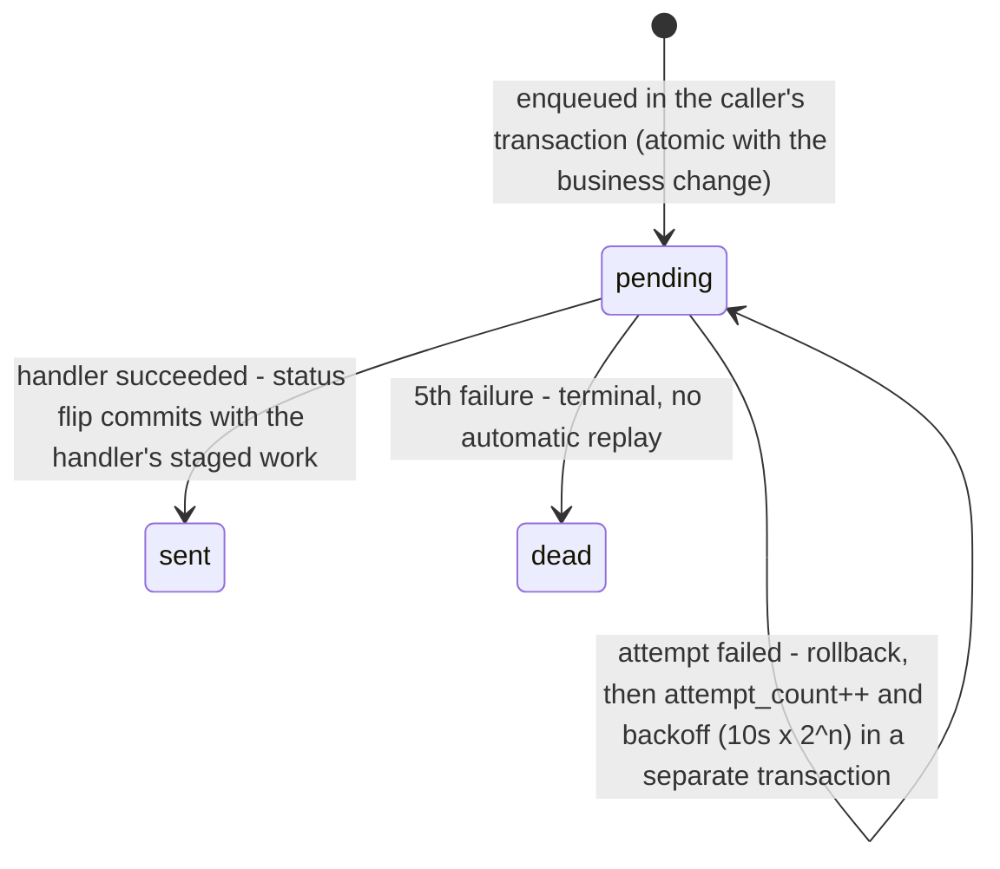

# Data Model

> Structural source of truth: entities, fields, relationships, and **derived rules** (computed,
> not stored). Stack-agnostic; concrete EF Core migrations follow in the repo. The multi-tenant
> base entities are constant; everything else is app-specific (JiggerJot).

## Conventions
- `id` primary key on every entity unless noted. UUIDv7 (`Guid.CreateVersion7()`) used — time-ordered,
  supported in .NET 9+ and already active in base entities.
- Timestamps (`created_at`, `updated_at`) assumed on all entities; omitted below for brevity.
- **Tenant scoping:** every app entity that holds tenant data implements `ITenantScoped`
  (a `TenantId`) and is filtered automatically by a global EF query filter (see ADR-003) — you
  can't forget to scope a read. Genuinely cross-tenant/pre-auth reads use the sanctioned escape
  hatch **`IRepository<T>.QueryAllTenants()`** (audited; used by dissolve contributors), and a
  signature-/system-authenticated tenant-scoped write enters its tenant via
  **`ITenantContext.EnterTenant(tenantId)`** — `IgnoreQueryFilters()` is **banned in
  `src/Api/Features/**`** (a build-time test enforces it). Never leak across tenants.
- "Tenant" is the code term for the household/org/team. The reference implementation labels it
  **Household**; JiggerJot keeps that label (JJ-001).
- **Shared vs. household-owned (JiggerJot):** `Ingredient`, `Cocktail` and `CocktailIngredient` use
  a single table each with a nullable `tenant_id` — **null = global/shared seed catalog**, **set =
  household-owned** (JJ-011, JJ-012). Because that column is nullable they are **not**
  `ITenantScoped`; their isolation comes from an app-level query filter mirrored by a hand-written
  RLS policy (JJ-031) — see "App entities".

## Base entities (constant — multi-tenant foundation)

### Tenant
The household/org/team. Owns all tenant-scoped data.
- `id` (UUIDv7)
- `name`
- *(JiggerJot adds no tenant-level fields in MVP.)*

### User
A person (identity). A user belongs to exactly one tenant **via `TenantMembership`** — there is
**no `tenant_id` on User**. Passwordless-capable; no password is stored.
- `id` (UUIDv7) — a plain POCO, **not** `IdentityUser`
- `email` (unique, normalized lower-case), `display_name` (nullable, refreshed from the provider)
- `email_verified` — true only when a provider asserts a verified email (fail-closed default; this
  guards the credential-attachment takeover)
- `locale` (nullable) — per-user UI language preference
- `theme` (nullable) — per-user UI theme ("light"/"dark"/"system", stored verbatim; null = never
  chose, which lets sign-in adopt a device-local choice — PREFS-1, ADR-022)
- `preferred_unit_system` — enum `metric` | `imperial` *(JiggerJot, JJ-008: the app's only
  per-user preference, a per-user carve-out like `locale`/`theme`; drives display conversion only)*
- `logins` — navigation to `UserLogin`

### UserLogin
One OAuth identity linked to a `User` (a user may link several providers).
- `id` (UUIDv7), `user_id` (FK → User)
- `provider` ("google", "microsoft", …), `provider_user_id`
- unique on (`provider`, `provider_user_id`)

### TenantMembership *(the user→tenant link — source of truth for tenancy)*
- `id` (UUIDv7), `tenant_id` (FK → Tenant), `user_id` (FK → User)
- **unique on `user_id`** — a user is in exactly one tenant at a time
- `role` — `owner` | `admin` | `member` (exactly one owner per tenant; `admin` is a delegated-management
  tier — ADR-009), `joined_at`. Capabilities per role are defined in `RolePermissions`, not ad-hoc checks.

### RefreshToken
A rotating, hashed refresh token backing a session — only the **hash** is stored, so a DB leak
can't forge sessions.
- `id` (UUIDv7), `user_id`, `token_hash` (SHA-256), `provider`
- `issued_at`, `expires_at`, `is_revoked`, `issued_from_ip`

### LoginToken *(passwordless: magic link + email OTP)*
A single-use, hashed, time-limited credential. The account is resolved/created at redemption, so a
typo'd or probed email leaves no account behind.
- `id` (UUIDv7), `email`, `code_hash` (SHA-256), `purpose` (`magic-link` | `otp`)
- `created_at`, `expires_at`, `consumed_at` (nullable), `attempt_count` (OTP lockout)
- **Derived (computed, never stored):** `is_expired`, `is_consumed`, `is_valid`

### UserMfa *(MFA — authenticator TOTP; ADR-012)*
A user's TOTP second-factor state (one per user). User-scoped identity data (wiped by account erasure).
- `id` (UUIDv7), `user_id` (unique) — one MFA row per user
- `encrypted_secret` — the TOTP secret **encrypted at rest** (Data Protection); never plaintext, never
  returned after enrollment
- `enabled` (true only after a valid code confirms possession), `enrolled_at`
- `last_verified_time_step` (nullable) — the TOTP time-step accepted by the most recent successful
  **login** step-up; a code whose step is ≤ this is rejected as a replay (RFC-6238 anti-replay; v2
  audit LOGIC-S1). Null until the first login step-up; enrollment-confirm deliberately does not set it.

### MfaRecoveryCode *(MFA — ADR-012)*
Single-use recovery codes, stored **only as hashes** (SHA-256); the raw codes are shown once at
enrollment. User-scoped (wiped by account erasure).
- `id` (UUIDv7), `user_id`, `code_hash`, `used_at` (nullable — consumed when set)

### Notification *(in-app notifications — ADR-013)*
A per-user notification. **Keyed by `user_id` — NOT tenant-scoped** (the ADR-C2 per-user carve-out); a
user only ever sees their own. User PII (wiped by account erasure).
- `id` (UUIDv7), `user_id`, `kind` (stable verb), `title`, `body`
- `metadata` (jsonb, nullable — identifiers only, no secrets), `read_at` (nullable), `created_at`
- indexed on `(user_id, created_at)` for the newest-first feed + unread counts

### NotificationPreference *(in-app notifications — ADR-013)*
Per-user delivery preferences (the ADR-C2 per-user carve-out, like `User.Locale`). One row per user;
absence ⇒ both channels on. User PII (wiped by account erasure).
- `id` (UUIDv7), `user_id` (unique), `in_app_enabled`, `email_enabled` (both default true)

### TenantInvitation *(constant — auth foundation)* — implements `ITenantScoped`
An email invitation to join a tenant. The raw token is revealed once at creation; only its hash is
stored.
- `id` (UUIDv7), `tenant_id` (FK → Tenant)
- `invited_email` — normalized lower-case
- `token_hash` (SHA-256) — **no raw token column**
- `invited_by_user_id` (Guid), `status` (`pending` | `accepted` | `revoked` | `expired`)
- `created_at`, `expires_at`

**Derived rules (computed, never stored):**
- `is_expired` → `now > expires_at`
- `is_valid` → `status == pending AND !is_expired`

## App entities (JiggerJot)

> Designed fresh for this app (2026-06-17), aligned to the platform 2026-09-08 (JJ-028). Household
> = tenant. **`TenantInventory` is the only app entity that implements `ITenantScoped`**;
> `Ingredient`, `Cocktail` and `CocktailIngredient` are dual-natured (nullable `tenant_id`) and are
> filtered by hand per JJ-031; `IngredientCategory`, `IngredientSubstitution`, `GlassType`, `Method`
> and `Unit` are global lookups with no tenant column. Every entity that can hold household data
> registers an `ITenantDataContributor` so it participates in tenant export and dissolve — including
> the dual-natured three, whose contributors must scope to the household's own rows and never touch
> the shared catalog.
>
> **Resolved by JJ-031 (2026-09-09).** `Ingredient`, `Cocktail` and `CocktailIngredient` keep the
> single-table shape with a nullable `tenant_id`, and therefore **do not implement `ITenantScoped`**:
> that interface's `TenantId` is non-nullable, and the platform's global filter and forced RLS policy
> (`TenantId = current`) would hide every shared row. Isolation is restored deliberately, in two
> mirrored places that must be changed together:
>
> - **App-level EF query filter** in `AppDbContext.OnModelCreating`, alongside the platform's own
>   loop: `x.TenantId == null || x.TenantId == CurrentTenantId`.
> - **Hand-written RLS policies** shipped in the same migration that creates each table — four of them,
>   one per command (`RlsDdl.SharedOrTenantStatementsFor`). `SELECT` admits shared rows
>   (`"TenantId" IS NULL OR "TenantId" = current OR bypass`); `INSERT`, `UPDATE` and `DELETE` admit the
>   household's own rows only. The asymmetry is not decoration: Postgres checks `DELETE` against `USING`
>   and never against `WITH CHECK`, so one `FOR ALL` policy with the read predicate would let any
>   household delete the shared catalog (JJ-031 amendment ①). Writing a shared row therefore needs the
>   bypass GUC, which is what makes seeding a deliberate act.
>
> Three platform guarantees do **not** apply to these three tables and are replaced by explicit tests:
> `TenantStampingInterceptor` will not stamp them (a household-owned row must set `TenantId` at the
> call site); `RlsMigrationGateTests` only inspects `ITenantScoped` tables, so nothing fails CI
> if the policy is dropped by a later migration; and `EveryTenantOwnedEntity_IsWiredIntoTenantDissolution`
> only sees a **non-nullable** `TenantId`, so it cannot tell whether these tables are wired into tenant
> teardown at all (JJ-031 amendment ②). `TenantInventory` is ordinary tenant data and does
> implement `ITenantScoped`; the lookup tables carry no tenant column at all.

### Ingredient
Single table for both shared and custom ingredients (JJ-011).
- `id`
- `tenant_id` — **null = shared catalog**, set = household-custom.
- `name`
- `category_id` → IngredientCategory (the top level, e.g. Rum)
- `subcategory_id` → IngredientCategory (nullable; the child level, e.g. Dark Rum)

> Custom ingredients (tenant_id set) are private to that household. They satisfy recipe lines by
> **exact match only** in MVP — they do not participate in the substitution graph (JJ-018).
> Ingredients are generic ("vodka", not "Tito's") — JJ-017.

### IngredientCategory
Two-level categorization (category + subcategory) that drives filtering (JJ-015). Global lookup.
- `id`
- `name`
- `parent_id` — nullable; null = top-level category, set = subcategory under that parent.

> Modeled as a self-referencing table to keep two levels clean and extensible. Filtering "all
> rum" matches the parent and all its children; "dark rum" matches the child. Filtering also
> works by ingredient **name** as well as by category — both are supported (JJ-016).

### Cocktail
Single table for both shared and custom cocktails (JJ-012).
- `id`
- `tenant_id` — **null = shared catalog**, set = household-custom.
- `forked_from_cocktail_id` — nullable; provenance only. Set when this cocktail was created via
  "Create my own version" of another. **A fork is a full snapshot copy** — changes to the
  original never propagate (JJ-013).
- `name`
- `glass_type_id` → GlassType
- `method_id` → Method
- `serving_type` — enum: `shot` | `full_drink`
- `instructions` — free text (preparation steps / notes)

> No `base_category` / "main spirit" field. A cocktail's spirit(s) are derived from its recipe
> lines + ingredient categories (JJ-014). Manual primary classification is a pinned future feature.

### CocktailIngredient *(the recipe line — the heart of the model)*
Links a cocktail to one ingredient with how it's used. Scoped with its cocktail.
- `id`
- `cocktail_id` → Cocktail
- `ingredient_id` → Ingredient
- `amount` — numeric, nullable (nullable for "to taste" / garnishes)
- `unit_id` → Unit (nullable, pairs with amount)
- `is_required` — boolean. **Drives the makeable calculation.** Garnishes are simply
  `is_required = false` (JJ-009).
- `role` — enum: `base` | `modifier` | `juice` | `syrup` | `bitters` | `garnish` | `mixer` |
  `other` (used for display grouping; final list TBD when seeding — JJ-010).
- `display_order` — integer, for stable recipe ordering.
- `notes` — nullable free text (e.g. "freshly squeezed").

> The same ingredient may appear on multiple lines of one cocktail — **not constrained to
> unique**. Quantities are structured (amount + unit) and stored as authored (JJ-007).

### IngredientSubstitution
Global-only substitution graph (MVP; JJ-004, JJ-005). Both substituted ingredients must be
**shared** (tenant_id null) ingredients.
- `id`
- `ingredient_id` → Ingredient (the one a recipe calls for)
- `substitute_ingredient_id` → Ingredient (what can stand in)
- Symmetry handled by storing **both directions** as separate rows (simpler queries than a
  symmetric flag — JJ-006).

### TenantInventory — implements `ITenantScoped`
The availability checklist. Sparse — a row exists only for ingredients the household has marked.
- `id`
- `tenant_id` → Tenant
- `ingredient_id` → Ingredient (shared or this household's custom)
- `is_available` — boolean. (Absence of a row = not available.) Boolean only — JJ-023.

### GlassType / Method / Unit
Curated lookup tables (no tenant additions in MVP — JJ-022).
- **GlassType:** `id`, `name` (coupe, rocks, highball, …)
- **Method:** `id`, `name` (shake, stir, build, blend, muddle, …)
- **Unit:** `id`, `name`, `system` (`metric` | `imperial` | `neutral`), conversion metadata.
  - Convertible units (oz ↔ ml) carry conversion factors.
  - **Neutral / non-convertible** units (dash, barspoon, piece, leaves, to-taste) display as
    authored regardless of user preference.

### Supporting types

Not tables, but they live in `src/Core/Entities/` and the schema is written in their terms.

- **`ISharedOrTenantScoped`** — the marker on `Ingredient`, `Cocktail` and `CocktailIngredient`: a
  nullable `TenantId` where null means "shared catalog, readable by every household and owned by none"
  (JJ-031). Its sibling `ITenantScoped` cannot express that row, which is the whole reason it exists.
  Anything marked with it opts out of three platform guarantees — see the note at the top of this
  section.
- **`ServingType`** — `shot` | `full_drink`, on `Cocktail`. A browse filter facet.
- **`RecipeRole`** — `base` | `modifier` | `juice` | `syrup` | `bitters` | `garnish` | `mixer` |
  `other`, on `CocktailIngredient`. **Display grouping only** — makeability keys off `is_required`, so a
  garnish blocks nothing by virtue of its role (JJ-009, JJ-010).
- **`UnitSystem`** — `metric` | `imperial` | `neutral`, on `Unit` and on `User.preferred_unit_system`.
  A neutral unit has no millilitre factor and always displays as authored (JJ-007, JJ-008).

## Relationship summary
- Tenant 1 — N TenantMembership N — 1 User *(constant; unique on `user_id` = one tenant per user)*
- User 1 — N UserLogin *(constant)*
- User 1 — N RefreshToken *(constant)*
- Tenant 1 — N TenantInvitation *(constant)*
- LoginToken is keyed by email (no FK — the account is resolved at redemption) *(constant)*
- Tenant 1 — N Ingredient (custom) / 1 — N Cocktail (custom) / 1 — N TenantInventory *(JiggerJot)*
- Cocktail 1 — N CocktailIngredient (recipe lines); Ingredient 1 — N CocktailIngredient
- Ingredient N — N Ingredient via IngredientSubstitution (both directions stored)
- IngredientCategory self-referencing (parent / subcategory)
- Cocktail → GlassType, Method; CocktailIngredient → Unit; Ingredient → IngredientCategory ×2

### ER diagram — identity & auth foundation

Drawn from the code (entities in `src/Core/Entities/`, constraints in
`src/Infrastructure/Persistence/Configurations/`). **Solid lines are real FK constraints (there
are only four in the whole model, all cascade); dotted lines are logical, application-enforced
Guid references with no DB constraint.** Invariants are annotated on the columns they protect.
Decision context: [ADR-002](DECISIONS.md) (custom JWT auth), [ADR-003](DECISIONS.md)
(membership-based tenancy), [ADR-012](DECISIONS.md) (MFA), [ADR-013](DECISIONS.md) (notifications).

```mermaid
erDiagram
    TENANT ||--o{ TENANT_MEMBERSHIP : "FK cascade"
    USER ||--o| TENANT_MEMBERSHIP : "FK cascade - unique user_id = one tenant per user"
    TENANT ||--o{ TENANT_INVITATION : "FK cascade"
    USER ||--o{ USER_LOGIN : "FK cascade"
    USER ||..o{ REFRESH_TOKEN : "user_id - no FK"
    USER ||..o| USER_MFA : "user_id unique - no FK"
    USER ||..o{ MFA_RECOVERY_CODE : "user_id - no FK"
    USER ||..o{ NOTIFICATION : "user_id - no FK"
    USER ||..o| NOTIFICATION_PREFERENCE : "user_id unique - no FK"
    USER ||..o{ LOGIN_TOKEN : "by email string only - account resolved at redemption"

    TENANT {
        guid id PK
        string name
    }
    USER {
        guid id PK
        string email UK "unique, normalized lower-case"
        bool email_verified "fail-closed: true only when a provider asserts it"
        string locale "nullable - per-user pref"
        string theme "nullable - stored verbatim (ADR-022)"
    }
    TENANT_MEMBERSHIP {
        guid tenant_id FK
        guid user_id FK,UK "unique - a user is in exactly one tenant"
        string role "owner | admin | member - exactly one owner per tenant"
    }
    TENANT_INVITATION {
        guid tenant_id FK
        string invited_email
        string token_hash UK "SHA-256 - no raw token column"
        string status "pending | accepted | revoked (expired is computed, never written)"
        datetimeoffset expires_at
    }
    USER_LOGIN {
        guid user_id FK
        string provider "unique with provider_user_id"
        string provider_user_id
    }
    REFRESH_TOKEN {
        guid user_id
        string token_hash UK "SHA-256 - DB leak cannot forge sessions"
        bool is_revoked "revoked-but-unexpired rows kept for reuse detection"
        datetimeoffset expires_at
    }
    LOGIN_TOKEN {
        string email "no user FK"
        string code_hash "SHA-256, single-use"
        string purpose "magic-link | otp"
        datetimeoffset consumed_at "nullable - set once, atomically"
        int attempt_count "OTP lockout counter"
    }
    USER_MFA {
        guid user_id UK "one MFA row per user"
        string encrypted_secret "Data Protection - never plaintext"
        bool enabled
        long last_verified_time_step "TOTP anti-replay watermark"
    }
    MFA_RECOVERY_CODE {
        guid user_id
        string code_hash "peppered HMAC - low-entropy secret"
        datetimeoffset used_at "nullable - single-use"
    }
    NOTIFICATION {
        guid user_id "per-user carve-out, NOT tenant-scoped"
        string kind "security.* kinds are non-suppressible"
        datetimeoffset read_at "nullable"
    }
    NOTIFICATION_PREFERENCE {
        guid user_id UK
        bool in_app_enabled "absence of row = both channels on"
        bool email_enabled
    }
```

### ER diagram — JiggerJot domain (as conceived; confirmed at Phase 5)

## Derived rules (computed, never stored)

### Makeable (JJ-003)
A cocktail is **makeable** for a household when **every `is_required` recipe line is satisfied**.
A required line is satisfied when the household has, marked available, either:
- the line's exact ingredient, **or**
- any valid substitute of it (via IngredientSubstitution; shared ingredients only).

Optional lines (`is_required = false`, e.g. garnishes) never block makeability.

### Almost makeable (JJ-019)
A cocktail is **almost makeable** when **exactly one** required line is unsatisfied (after
applying substitutions). Surface the missing ingredient(s) as a discovery / shopping driver.
(Generalizable to "N short," but MVP fixes N = 1.)

### Ice & water (JJ-020)
Ubiquitous staples (ice, water) are **assumed always available** and are **not modeled as
blocking inventory**. Either omit them from required lines or treat them as always-satisfied.

### Unit display conversion (JJ-007, JJ-008)
Stored **as authored** (2 oz stays "2 oz"). At display time, convert convertible units to the
viewing user's `preferred_unit_system`. Neutral/non-convertible units pass through unchanged.

### Spirit / ingredient filtering (JJ-014, JJ-016)
A cocktail's spirit(s) and ingredient facets are derived from its recipe lines and their
ingredients' categories; a filter on a parent category matches all its children, and a filter also
matches by ingredient name.

## Platform entities (built — ADRs 006–016)

> These are the tenant-/platform-scoped tables the platform epics added. All have EF Core migrations.
> New app/domain tables you add should implement `ITenantScoped` (so the global tenant filter covers
> them) and register an **`ITenantDataContributor`** (with `ExportKey` + `ExportAsync` **and**
> `HasDataAsync`/`WipeAsync`) so they participate in tenant export + dissolve — there is **no** central
> `HasDataAsync`/`WipeDataAsync` method to edit (adding a feature never means touching central code).

- **`Subscription`** *(ADR-006 / `docs/stories/billing.md`)* — ✅ **BUILT (BILLING-1..7)**:
  `src/Core/Entities/Subscription.cs`, migration `AddSubscription`. `ITenantScoped`, **unique per
  tenant**; `plan_key`, `status`, `stripe_customer_id`/`stripe_subscription_id`, `current_period_end`,
  `lapse_notified_at` (nullable — set by the BILLING-6 lapse sweep so it nudges once per lapse),
  `last_event_at` (nullable — the timestamp of the most recently *applied* webhook event; the handler
  applies an incoming event only if strictly newer, so a redelivered/out-of-order older event can't
  clobber newer state — v2 audit LOGIC-B1). A **projection** of Stripe state (Stripe is the source of
  truth for money); absent ⇒ Free tier (fail-closed), as is any non-active/lapsed status. Plan catalog
  is code (`src/Core/Billing/PlanCatalog.cs`), not a table. Participates in dissolve via
  `BillingDataContributor` (cancels the provider sub + wipes the projection).
- **`UsageCounter`** *(ADR-006 / `docs/stories/billing.md`)* — ✅ **BUILT (BILLING-5)**:
  `src/Core/Entities/UsageCounter.cs`. `ITenantScoped`. A per-tenant, per-period metered-usage counter:
  `key` (the metered action, e.g. "export"), `period` (a calendar month `yyyy-MM`, UTC), `count`,
  `updated_at`. One row per (tenant, key, period) — the month-keyed period makes it **self-resetting
  with no reset job**. `IQuotaService.TryConsumeAsync` increments it and denies once the plan's monthly
  limit is reached.
- **`ApiKey`** *(ADR-015 / `docs/stories/pubapi.md`)* — ✅ **BUILT (PUBAPI-1)**:
  `src/Core/Entities/ApiKey.cs`. `ITenantScoped`. A tenant-scoped API key for programmatic access — only
  the **hash** is stored: `name`, `key_hash` (deterministic hash for O(1) lookup), `prefix` (short
  non-secret display prefix), `scopes` (comma-separated), `created_by_user_id`, `created_at`,
  `last_used_at`, `expires_at` (nullable), `revoked_at` (nullable). The raw key is shown once at
  creation. A presented key authenticates as its tenant (mints a `tenant_id`-claim principal).
- **`WebhookSubscription`** *(ADR-016 / `docs/stories/hooks.md`)* — ✅ **BUILT (HOOKS-1)**:
  `src/Core/Entities/WebhookSubscription.cs`. `ITenantScoped`. A tenant's outbound webhook subscription:
  `url`, `event_types` (comma-separated), `encrypted_secret` (the HMAC signing secret **encrypted** at
  rest via Data Protection — needed in plaintext to sign, so it can't be hashed; revealed once),
  `created_by_user_id`, `created_at`, `disabled_at` (nullable). Delivery goes through the outbox
  (ADR-007), so it's durable + retried.
- **`WebhookDelivery`** *(ADR-016 / `docs/stories/hooks.md`)* — ✅ **BUILT (HOOKS-2)**:
  `src/Core/Entities/WebhookDelivery.cs`. **NOT `ITenantScoped`** — like `OutboxMessage` it's written
  from the tenant-less outbox dispatcher, so `tenant_id` is a **plain filter column** the read side
  filters on, not a global-filter scoping key. A per-attempt delivery record (retries add rows):
  `subscription_id`, `event_type`, `event_id`, `body` (the exact JSON sent — retained so a delivery can
  be **replayed**), `success`, `status_code` (nullable), `error` (nullable), `created_at`. Success rows
  commit atomically with the outbox `sent` flip; **failure rows are written through a fresh out-of-band
  context** so they survive the processor's rollback (2026-08-24 fix — staged failure rows were being
  discarded, leaving the log success-only).
- **`OutboxMessage`**, **`InboxMessage`**, **`AuditEvent`** — see below.

### ER diagram — platform entities (as built)

Drawn from the code. Every dotted line is a **logical** tenant/subscription reference (plain Guid
column, no FK constraint); the platform relies on the global query filter + RLS for isolation, not
on referential integrity to `Tenant`. Decision context: [ADR-006](DECISIONS.md) (billing),
[ADR-007](DECISIONS.md) (outbox/inbox), [ADR-008](DECISIONS.md) (audit),
[ADR-015](DECISIONS.md) (API keys), [ADR-016](DECISIONS.md) (webhooks).

## Platform infra entities (built — not `ITenantScoped`)
- **`OutboxMessage`** *(ADR-007 / `docs/stories/async-jobs.md`)* — ✅ **BUILT (JOBS-1)**:
  `src/Core/Entities/OutboxMessage.cs`, migration `AddOutbox`. **NOT** `ITenantScoped` (platform infra;
  carries an optional `TenantId` for context). `type`, `payload` (text/JSON), `status`,
  `attempt_count`, `next_attempt_at`, `processed_at`, `last_error`. Written in the **same transaction**
  as the business change (atomic effects).
- **`InboxMessage`** *(ADR-007 / `docs/stories/async-jobs.md`)* — ✅ **BUILT (JOBS-2)**:
  `src/Core/Entities/InboxMessage.cs`, migration `AddInbox`. **NOT** `ITenantScoped`. Dedup ledger for
  idempotent inbound (webhook) deliveries: `id`, `source`, `idempotency_key`, `received_at`; **unique on
  `(source, idempotency_key)`**. `IInbox.TryClaimAsync` claims via `INSERT … ON CONFLICT DO NOTHING`
  inside the caller's transaction (claim + work commit together). Built as a separate ledger rather than
  an outbox `direction` column — see the ADR-007 amendment.
- **`AuditEvent`** *(ADR-008 / `docs/stories/observability.md`)* — ✅ **BUILT (OBS-4)**:
  `src/Core/Entities/AuditEvent.cs`, migration `AddAuditEvent`. `ITenantScoped`, **append-only**;
  `actor_user_id`, `action`, `entity_type`, `entity_id`, `metadata` (jsonb), `created_at`. Written via
  explicit `IAuditLog.RecordAsync` (stages on the caller's unit of work); append-only enforced by
  `AuditAppendOnlyInterceptor` (throws on tracked update/delete). `AuditDataContributor` purges on
  dissolve (set-based delete bypasses the guard). No secrets/PII in `metadata`. Dissolve vs retention:
  export-then-wipe if legal-hold is required (GDPR backlog).
## Lifecycles (state diagrams, as built)

Drawn from the service code, not the prose. Each diagram notes where reality diverges from what
the status column suggests.

### TenantInvitation — [ADR-003](DECISIONS.md)

`expired` exists as a constant but **is never written**; expiry is computed against `expires_at`
at accept time. Accept is an atomic conditional update (`TryAcceptAsync` — only one racer wins).

### Subscription — [ADR-006](DECISIONS.md)

The row is a projection; **no row means Free** (fail-closed), and every transition comes from a
signature-verified provider webhook except the staff comp path (ADR-021).

### LoginToken (magic link / OTP) — [ADR-C15](DECISIONS.md)

### RefreshToken — [ADR-002](DECISIONS.md)

### OutboxMessage — [ADR-007](DECISIONS.md)

## Pinned model extensions (future, not built)
- SMS/phone field on User — needed when phone-based OTP is implemented.
- New app/domain tables — implement `ITenantScoped` so the global tenant filter covers them, and
  register an `ITenantDataContributor` (`ExportKey` + `ExportAsync` + `HasDataAsync`/`WipeAsync`) so
  they participate in tenant export + dissolve (there is no central wipe method to edit).
- **JiggerJot pins** (see `PROJECT_BRIEF.md` OUT list):
  - Tenant-level substitutions (add `tenant_id` to IngredientSubstitution).
  - Custom ingredients in the substitution graph / "treat as equivalent to" a shared ingredient.
  - Brand/product granularity (a "specific product *is a* generic ingredient" hierarchy).
  - Recipe-level substitutions (accepted subs enumerated per recipe line).
  - Publishing custom cocktails to a public pool (visibility/moderation fields on Cocktail).
  - Manual "primary classification" on Cocktail.
  - User-added lookup values (tenant_id on GlassType / Method / Unit).
  - Multi-state inventory ("running low").
